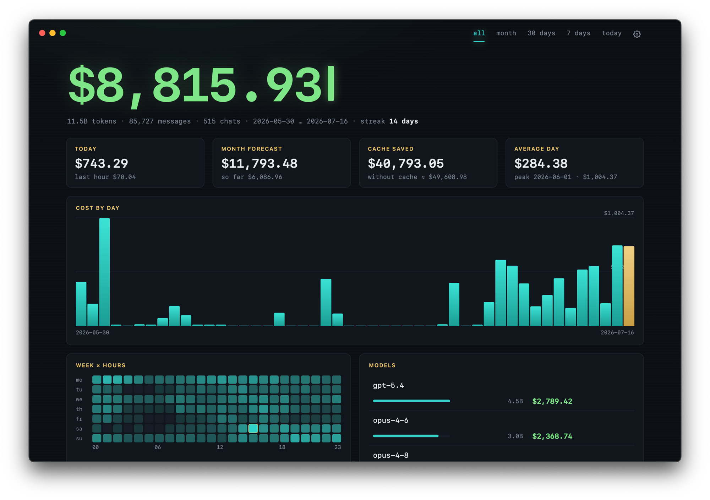
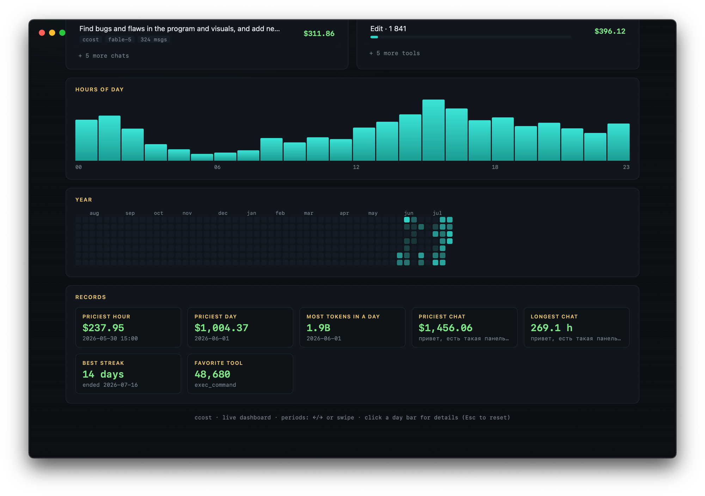
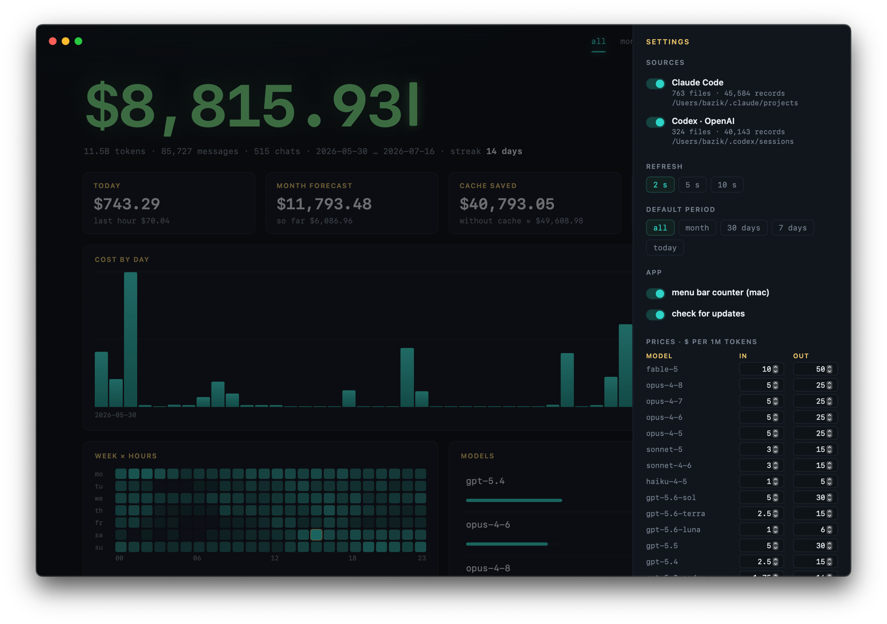
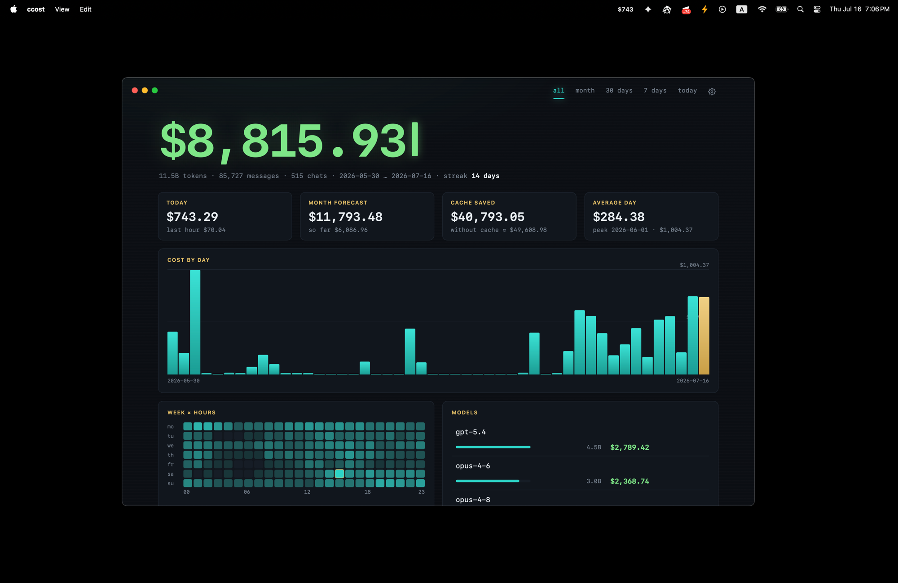
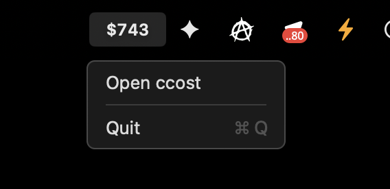

# ccost

Token and cost statistics for local **Claude Code** and **Codex (OpenAI)**
sessions, priced at API list rates. Ships as a terminal TUI, a live browser
dashboard, and native apps for macOS and Windows.

The engine is a single dependency-free Python file. The rest is not Python:
the dashboard is plain HTML/CSS/JS (`gui/`), the macOS app is Swift +
WKWebView (`macos/`), the Windows window uses WebView2.



## Layout

| path | language | purpose |
|---|---|---|
| `ccost` | Python | engine: JSONL parsers, pricing, TUI (curses), dashboard HTTP server; distributed as one self-contained file |
| `gui/` | HTML/CSS/JS | dashboard sources |
| `tools/embed.py` | Python | inlines `gui/` into `ccost` so distribution stays a single file |
| `macos/` | Swift | native ccost.app: seamless window, menu bar counter, icon generator |
| `.github/workflows/` | YAML | release binaries for every OS (PyInstaller + swiftc + dmg) |

Edit the dashboard in `gui/`, run `python3 tools/embed.py`, commit both.

## Usage

```sh
./ccost              # interactive TUI (live: numbers grow as agents work)
./ccost gui          # live dashboard in the browser
./ccost app          # same dashboard in a native window (Win/Linux/mac)
./ccost report       # full text report (also the pipe/non-tty fallback)
./ccost json         # aggregates as JSON, for scripts
```

Prebuilt binaries (no Python needed) are in
[releases](../../releases): `ccost-macos.dmg` (app), macOS universal2 /
Linux x86_64 / Linux arm64 / Windows CLI binaries, and
`ccost-windows-x64.exe` — a windowed app, double-click to run.

## Dashboard

Local server on 127.0.0.1, everything inline (no CDNs, works offline).
Live updates every few seconds via the incremental parser. Sections:
cost counter with live "+$" ticks, stat cards (today + last hour, month
forecast, cache savings, average day), daily bar chart with day drill-down
(click a bar, ←/→ to page days, Esc to reset), week × hours heatmap,
models, top chats, tools, hours of day, a GitHub-style year calendar, and
all-time records (priciest hour/day/chat, longest chat, best streak…).



Settings (gear icon):

- **sources** — Claude Code and Codex toggles, with paths and counts;
- **refresh** — polling interval (2/5/10 s);
- **default period**, **menu bar counter** (mac), **update checks**;
- **prices** — edit any model's rates in place; the whole history is
  repriced instantly. Stored in `~/.ccost.json`.



Data paths can be overridden via `claude_root`/`codex_root` in the config
or the `CCOST_ROOT`/`CCOST_CODEX_ROOT` environment variables.

## macOS app

`ccost.app` is a native shell: full-height window (the dashboard header is
the titlebar, drag it to move, double-click to zoom), Dock icon, Cmd+Q/W/R,
and an optional menu bar counter showing today's spend (the window can be
closed while the counter keeps running). The bundled engine is a PyInstaller
binary — no system Python required.





```sh
CCOST_ENGINE=/path/to/binary sh macos/build.sh   # or let it run pyinstaller
cp -R macos/dist/ccost.app /Applications/
```

## Windows

`ccost-windows-x64.exe` is a real app: double-click opens a frameless
window (the dashboard draws its own titlebar and — ▢ ✕ buttons, WebView2).
For terminal use there is `ccost-windows-cli.exe` (TUI glyphs default to
ASCII; set `CCOST_UTF8=1` in Windows Terminal for unicode bars). If Claude
Code lives in WSL, point the exe at it:
`set CCOST_ROOT=\\wsl.localhost\Ubuntu\home\<user>\.claude\projects`.

## TUI

Tabs: **Overview · Models · Days · Chats · Projects · Tools · Hours · Week**.
Mouse works: click tabs and rows, wheel scrolls, second click opens details.

| key | action |
|---|---|
| `←` `→` / `1`–`8` / `Tab` | switch tabs |
| `↑` `↓` / `j` `k` / `PgUp` `PgDn` / `g` `G` | scroll |
| `Enter` | details card for the selected row |
| `f` / `F` | period: all → today → 7 days → 30 days → month |
| `s` | sort by cost ↔ tokens/calls |
| `p` | pause/resume live updates |
| `r` | re-read everything |
| `q` / `Esc` | quit (Esc also closes the card) |

## How it counts

- **prices** — API list rates ($/1M tokens) for Anthropic (`PRICE`) and
  OpenAI (`PRICE_OPENAI`, cached input priced separately); model ids match
  by longest prefix; unpriced models count as $0 and are listed explicitly;
- **cache** — Anthropic 5-minute writes ×1.25, 1-hour writes ×2 (split via
  `usage.cache_creation`), reads ×0.1 of the input rate;
- **dedup** — streaming writes several JSONL lines per message with growing
  usage; the field-wise maximum per `message.id` is kept (the first line
  undercounts output, and resumed/forked sessions would double-count);
- **Codex** — usage comes from `token_count` events in rollout files, model
  and project from `turn_context`/`session_meta`, resume duplicates dropped.

Note: these are API list prices — what the usage would cost, not what a
subscription actually charges (same numbers `/status` shows).

## Performance

The full JSONL parse (gigabytes) happens once: parsed state is snapshotted
to `~/.cache/ccost/state.pickle` and later runs start in a fraction of a
second, reading only newly appended bytes. Cold parses run across several
processes. Prices are not part of the snapshot, so repricing never triggers
a re-parse.

## Rendering

The palette adapts to the terminal (256-color, 8/16, or mono), the
background stays native, and UTF-8 glyphs are enabled before `initscr` so
bars do not degrade to `?` even without `LANG`. `NO_COLOR=1` disables
colors, `CCOST_ASCII=1` forces ASCII graphics. Chat titles are sanitized
(ANSI codes stripped, wide glyphs replaced) so layouts never break.
